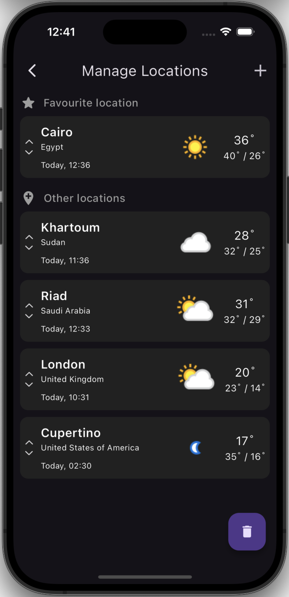
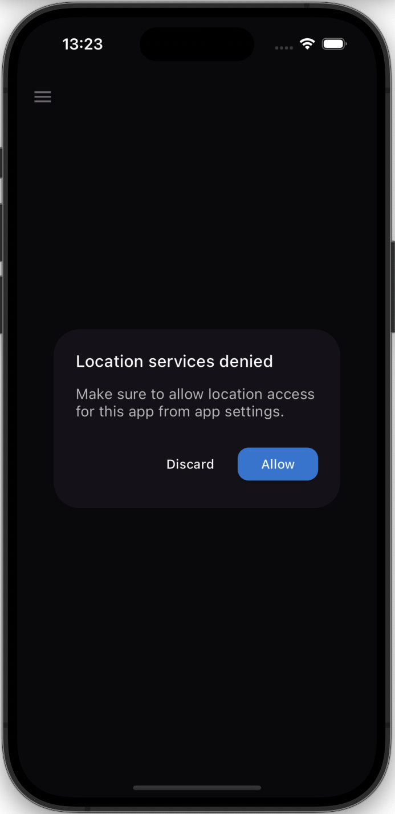
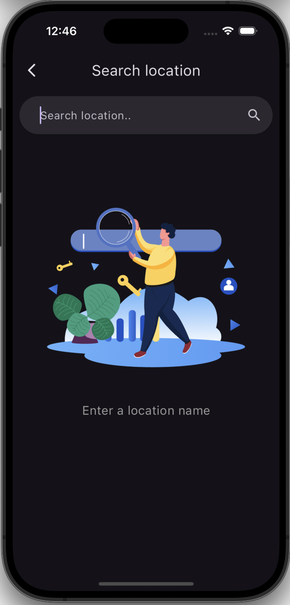

# Samsung weather app clone

Samsung weather app clone is a Flutter app with GetX state-management, integrates the free weather api from weatherapi.com


## Features 🌟
This app providing all of these features:
- 📍 Weather data from user’s location.
- 🌧️ Current weather data.
- ⌚ Hourly forecast.
- 📆 Daily forecast (8 days ahead).
- 🏙️ Add other cities and locations.
- 🔍 Search by city name, IP address, Latitude/Longitude (decimal degree), US Zipcode, UK Postcode and Canada Postalcode.

## Screenshots 📸

<div style="display: flex;">
  
   
   
   
   
   
</div>
<br>

### Search and autocomplete 🔍

<div style="display: flex;">
  
  
</div>
<br>

## Packages 📦
You can read more about each package on [pub.dev](https://www.pub.dev)

- `get`: ^4.6.6
- `path`: ^1.9.0
- `http`: ^1.2.2
- `shared_preferences`: ^2.2.3
- `intl`: ^0.19.0
- `font_awesome_flutter`: ^10.7.0
- `lottie`: ^3.1.2
- `flutter_svg`: ^2.0.10+1
- `dartz`: ^0.10.1
- `get_storage`: ^2.1.1
- `location`: ^7.0.0
- `fluttertoast`: ^8.2.6

## Usage
1. Clone this repository. Or [Download as ZIP file 📁](https://github.com/ahmedmt3/samsung_weather_app_clone/archive/refs/heads/main.zip)
```bash
git clone https://github.com/ahmedmt3/samsung_weather_app_clone.git
cd samsung_weather_app_clone
```
2. Get dependencies

```
flutter pub get
```

3. Inside `lib/core/config/app_config.dart` edit this line with your API key, [get API key.](https://www.weatherapi.com/login.aspx)
```dart
static const String apiKey = "YOUR_API_KEY";
```

4. Run the project 🎉
```
flutter run
```

## Installing
This app isn't available on the play store yet, but you can download the apk [from here]()

## API

<a href="https://www.weatherapi.com/" title="Free Weather API"></a>
<br>
This app powered by free weather API from [weatherapi.com](https://www.weatherapi.com)

<br>

## Contributing
You can contribute by reporting bugs, suggesting improvements, and/or by helping out in code.

</br>

## Getting Started With Flutter?

- [Lab: Write your first Flutter app](https://docs.flutter.dev/get-started/codelab)
- [Cookbook: Useful Flutter samples](https://docs.flutter.dev/cookbook)

For help getting started with Flutter development, view the
[online documentation](https://docs.flutter.dev/), which offers tutorials,
samples, guidance on mobile development, and a full API reference.
