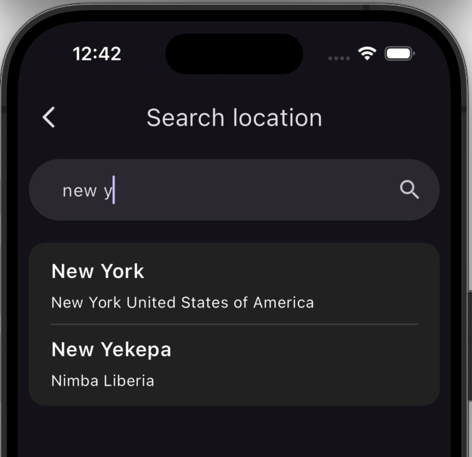

# Weather app

Samsung weather app clone with Flutter using free weatherapi.com
## Features
Weather app providing all of these features:
- Current weather data.
- Hourly forecast.
- Daily forecast (8 days ahead).
- Search by city name, IP address, Latitude/Longitude (decimal degree), US Zipcode, UK Postcode and Canada Postalcode.

### API
Weather app powered by free weather API from [weatherapi.com](https://www.weatherapi.com)

<a href="https://www.weatherapi.com/" title="Free Weather API"></a>

<br>

## Screenshots

<div style="display: flex;">
  
  
</div>
<div style="display: flex;">
  
  
</div>
<br>
<div style="display: flex;">
  
  
   
  
</div>
<br>


## Packages
You can read more about each package on [pub.dev](https://www.pub.dev)

- `get`: ^4.6.6
- `path`: ^1.9.0
- `http`: ^1.2.2
- `shared_preferences`: ^2.2.3
- `intl`: ^0.19.0
- `font_awesome_flutter`: ^10.7.0
- `lottie`: ^3.1.2
- `flutter_svg`: ^2.0.10+1

## Usage
1. Clone this repository. Or [Download ZIP file 📁](https://github.com/ahmedmt3/weather_app/archive/refs/heads/main.zip)
```bash
git clone https://github.com/ahmedmt3/weather_app.git
cd weather_app
```
2. Get dependencies & Run project

```bash
flutter pub get
flutter run
```
## Installing
Weather app isn't available on the play store yet, but you can download the apk [from here]()

## Contributing
You can contribute by reporting bugs, suggesting improvements, and/or by helping out in code.

</br>

## Getting Started With Flutter?

- [Lab: Write your first Flutter app](https://docs.flutter.dev/get-started/codelab)
- [Cookbook: Useful Flutter samples](https://docs.flutter.dev/cookbook)

For help getting started with Flutter development, view the
[online documentation](https://docs.flutter.dev/), which offers tutorials,
samples, guidance on mobile development, and a full API reference.
